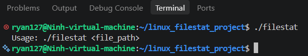
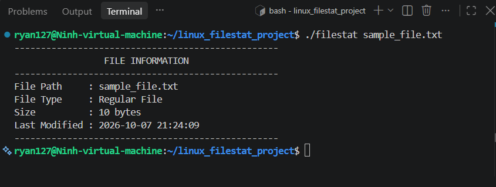
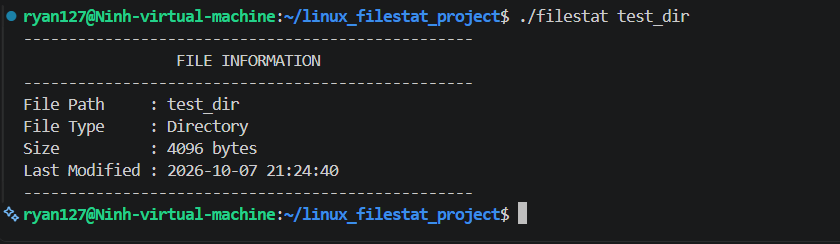
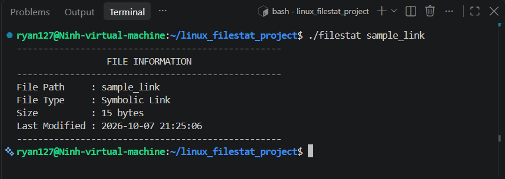
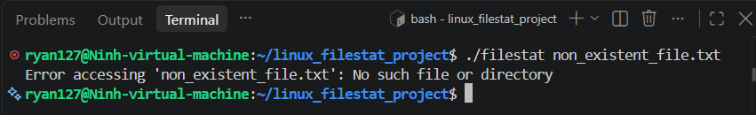

# BÁO CÁO BÀI TẬP: PHÂN TÍCH THÔNG TIN TỆP TIN BẰNG LSTAT TRONG C

* **Người thực hiện:** Ninh
* **Hệ điều hành:** Ubuntu 22.04 LTS (Linux x86_64, GCC 11.4.0)
* **Mục tiêu:** Xây dựng chương trình `filestat.c` sử dụng lệnh gọi hệ thống `lstat()` để trích xuất và hiển thị metadata của tệp tin hoặc thư mục (File Path, File Type, Size, Last Modified), xử lý an toàn đối số dòng lệnh và các trường hợp lỗi hệ thống.

---

## 1. CẤU TRÚC THƯ MỤC DỰ ÁN

```text
linux_filestat_project/
├── filestat.c          # Mã nguồn chính chứa logic gọi system call lstat
├── README.md           # Báo cáo kỹ thuật chi tiết
└── docs/
    └── images/         # Thư mục lưu trữ ảnh chụp màn hình kết quả
```

---

## 2. PHƯƠNG PHÁP THỰC HIỆN VÀ GIẢI THÍCH HÀM HỆ THỐNG

### 2.1. Kiểm tra đối số dòng lệnh
* Chương trình kiểm tra biến `argc`. Nếu `argc != 2` (người dùng không truyền đường dẫn hoặc truyền thừa tham số), chương trình sẽ in hướng dẫn sử dụng chuẩn ra luồng `stderr`:
  `Usage: ./filestat <file_path>`
  và kết thúc với mã lỗi `EXIT_FAILURE`.

### 2.2. Lệnh gọi hệ thống lstat() và cấu trúc struct stat
* Sử dụng lệnh gọi hệ thống `lstat(const char *pathname, struct stat *statbuf)` từ thư viện `<sys/stat.h>`.
* **Phân biệt `lstat()` và `stat()`:**
  * `stat()`: Tự động phân giải liên kết mềm (dereference symbolic link) và trả về thông tin của file đích mà link đó trỏ tới.
  * `lstat()`: Trả về thông tin của **chính bản thân liên kết mềm (Symbolic Link)** đó, giúp chương trình nhận diện chính xác loại đối tượng là `Symbolic Link`.

### 2.3. Nhận diện loại tệp tin
Sử dụng trường `st_mode` của `struct stat` kết hợp với các macro chuẩn POSIX trong `<sys/stat.h>`:
* `S_ISREG(st_mode)`: Trả về true nếu là **Regular File** (Tệp tin thông thường).
* `S_ISDIR(st_mode)`: Trả về true nếu là **Directory** (Thư mục).
* `S_ISLNK(st_mode)`: Trả về true nếu là **Symbolic Link** (Liên kết mềm).
* Ngoài ra, chương trình mở rộng nhận diện thêm các loại tệp tin đặc biệt: `Character Device`, `Block Device`, `FIFO / Pipe`, `Socket`.

### 2.4. Trích xuất dung lượng và thời gian sửa đổi
* **Kích thước tệp (Size):** Lấy trực tiếp từ trường `st_size` với đơn vị tính là `bytes`.
* **Thời gian sửa đổi lần cuối (Last Modified):** Lấy giá trị timestamp (`time_t`) từ trường `st_mtime`, sau đó dùng hàm `localtime()` và `strftime()` từ `<time.h>` để định dạng thành chuỗi ngày giờ tiêu chuẩn: `YYYY-MM-DD HH:MM:SS`.

## 3. HƯỚNG DẪN BIÊN DỊCH VÀ CHẠY CHƯƠNG TRÌNH

### 3.1. Biên dịch mã nguồn bằng GCC
```bash
gcc -Wall -Wextra filestat.c -o filestat
```

### 3.2. Chạy kiểm thử các trường hợp

```bash
# 1. Kiểm tra khi không truyền tham số
./filestat

# 2. Kiểm tra tệp tin thông thường
./filestat sample_file.txt

# 3. Kiểm tra thư mục
./filestat test_dir

# 4. Kiểm tra liên kết mềm
./filestat sample_link

# 5. Kiểm tra file không tồn tại
./filestat non_existent_file.txt
```


## 4. KẾT QUẢ THỰC NGHIỆM VÀ ĐÁNH GIÁ

### 4.1. Bảng tổng hợp các trường hợp kiểm thử

| Test Case | Lệnh thực thi | Loại đối tượng nhận diện | Kết quả đánh giá |
| :--- | :--- | :--- | :--- |
| **Case 1: Usage** | `./filestat` (không có tham số) | Không xác định | In thông báo `Usage` và thoát mã 1 |
| **Case 2: Regular File** | `./filestat sample_file.txt` | `Regular File` | Trả về dung lượng và thời gian sửa đổi chính xác |
| **Case 3: Directory** | `./filestat test_dir` | `Directory` | Nhận diện đúng thư mục |
| **Case 4: Symlink** | `./filestat sample_link` | `Symbolic Link` | `lstat` nhận diện đúng liên kết mềm |
| **Case 5: Error** | `./filestat non_existent_file.txt`| Không tìm thấy | In thông báo lỗi qua `strerror(errno)` |

### 4.2. Ảnh chụp màn hình kết quả kiểm thử

**1. Kết quả kiểm thử khi không truyền đối số (Usage Check):**

<div align="center">



*Hình 1: Kiểm tra xử lý đối số dòng lệnh khi người dùng không truyền tham số.*

</div>

**2. Kết quả kiểm thử Regular File:**

<div align="center">



*Hình 2: Phân tích thông tin của file văn bản thông thường.*

</div>

**3. Kết quả kiểm thử Directory:**

<div align="center">



*Hình 3: Phân tích thông tin của thư mục.*

</div>

**4. Kết quả kiểm thử Symbolic Link:**

<div align="center">



*Hình 4: Nhận diện liên kết mềm bằng system call lstat.*

</div>

**5. Kết quả kiểm thử File không tồn tại (Error Handling):**

<div align="center">



*Hình 5: Xử lý lỗi hệ thống khi đường dẫn không tồn tại.*

</div>
